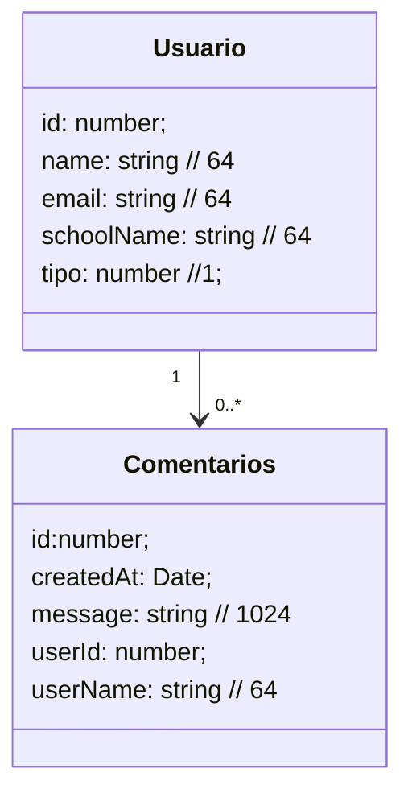

```mermaid
classDiagram


%%tipo: indica se é aluno ou professor, podendo ter outros tipos (0 ou 1)

class Usuario{
    id: number;
    name: string // 64
    email: string // 64
    schoolName: string // 64
    tipo: number //1; 
}

 Usuario "1" --> "0..*" Comentarios

class Comentarios{
    id:number;
    createdAt: Date;
    message: string // 1024
    userId: number;
    userName: string // 64
}
```