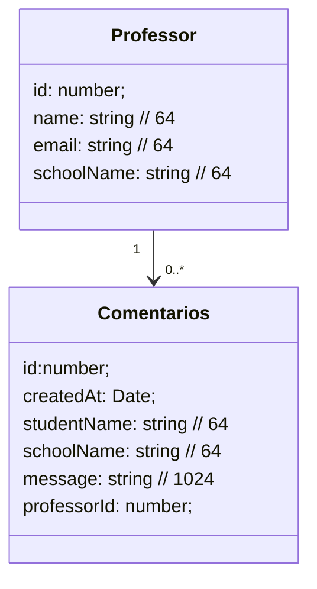

```mermaid
classDiagram

class Professor{
    id: number;
    name: string // 64
    email: string // 64
    schoolName: string // 64

}

 Professor "1" --> "0..*" Comentarios

class Comentarios{
    id:number;
    createdAt: Date;
    studentName: string // 64
    schoolName: string // 64
    message: string // 1024
    professorId: number;
}
```